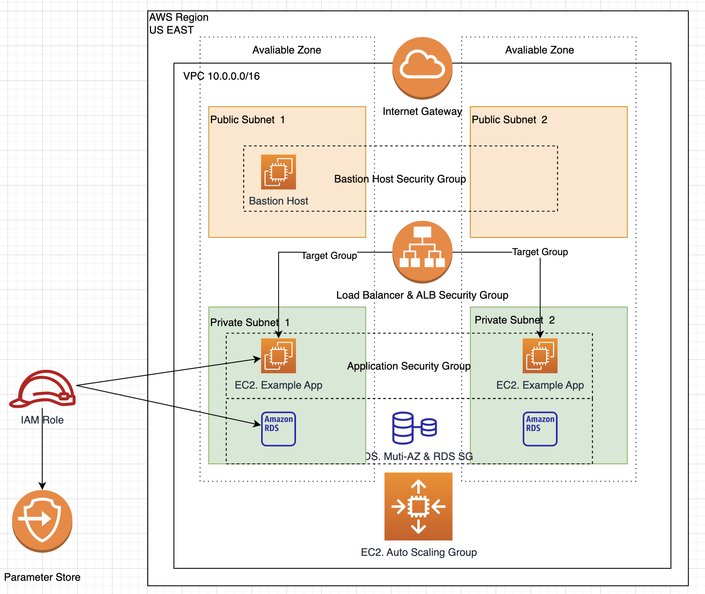

## Solution Summary

To complete the design of the entire solution, I have made the following architecture design. Firstly, the AWS VPC is divided into four subnets, where two Public Subnets are used for internet access or deployment of Bastion Host, and two Private Subnets are used for deploying Application and RDS databases, where direct access from the internet to Private Subnets is not allowed. To achieve internet SSH access for the Bastion Host, I opened port 22 of the SSH protocol on its security group, allowing access from Any Network. To achieve Auto Scaling for the Application, I configured an Auto Scaling Group that allows AWS to automatically create EC2 instances in the two Private Hosts using templates. To enable Application access to data in the EC2 instance, I deployed a Muti-AZ RDS instance, which automatically deploys a MySQL instance that can be synchronized between the two Private Subnets in two Availability Zones. Meanwhile, I configured different IAMs for the EC2 instance and the RDS instance to facilitate sufficient permission to access the database. To ensure parameter security and adjustability, I saved the following four database parameters in the Parameter Store.

- /example/endpoint
- /example/username
- /example/password
- /example/database

Finally, I created a Load Balancer instance and added the EC2 Application instance in the Private Subnet to the Target Group, enabling access to the actual deployed application from the internet.

## Cost Estimation and Tracking.

In the project, I used the AWS Pricing Calculator tool to estimate the monthly cost of AWS resources required for the solution. The following is the cost estimation diagram I created. You can also see https://calculator.aws/#/estimate?key=new&id=0adfb1597159615b079a098b9dae39e8aed4ae16 to preview the cost estimation summary.

During the actual implementation process, due to the lack of permissions for AWS Cost Manager, I had to manually check the daily expenses of the Lab environment to track the actual budget execution. As the overall budget for the entire project was only 60 USD, I had to shut down resources such as EC2 and RDS before clicking the "End Lab" button to minimize potential expenses. As of 5/15/2023, after completing the project deployment, I have already spent 10.3 USD in the AWS Lab account, accounting for 17.2% of the total budget. The project cost is currently within a reasonable range.